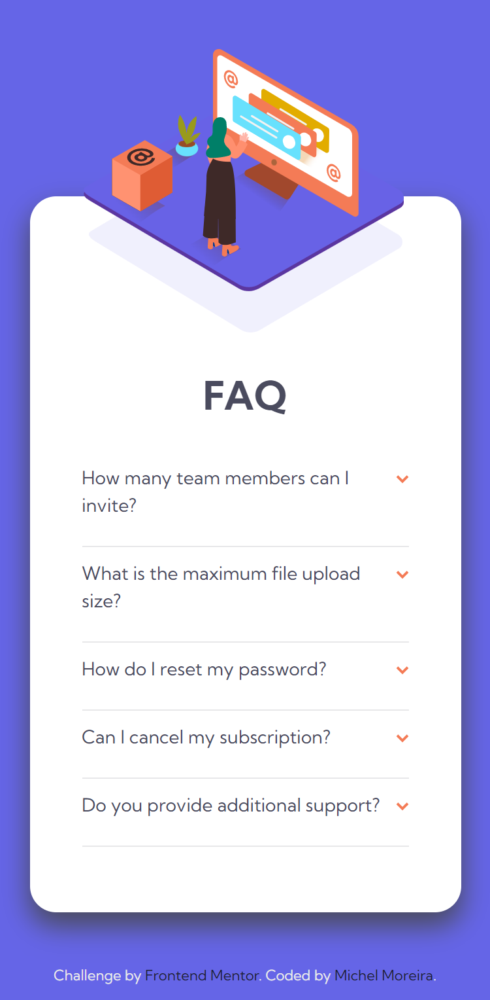

# Frontend Mentor - FAQ accordion card solution

This is a solution to the [FAQ accordion card challenge on Frontend Mentor](https://www.frontendmentor.io/challenges/faq-accordion-card-XlyjD0Oam).

## Table of contents

- [Overview](#overview)
  - [The challenge](#the-challenge)
  - [Screenshot](#screenshot)
  - [Links](#links)
- [My process](#my-process)
  - [Built with](#built-with)
  - [What I learned](#what-i-learned)
  - [Useful resources](#useful-resources)
- [Author](#author)
- [Acknowledgments](#acknowledgments)

## Overview

### The challenge

Users should be able to:

- View the optimal layout for the component depending on their device's screen size
- See hover states for all interactive elements on the page
- Hide/Show the answer to a question when the question is clicked

### Screenshot

- Desktop 1440px


- Mobile 375px



## My process

### Built with

- Semantic HTML5 markup
- CSS custom properties
- Flexbox

### What I learned

- This project made me learn about semantic HTML5 markup, like the tags `<details>` and `<summary>`;

- Working with flexible display using the flexbox properties, positioning elements on the screen.

- Working with position relative and absolute; the usage of z-index and the property overflow.

- Working with external fonts (Google fonts) to improve a better custom apparence.

- Working with separated documents, improving organization and responsability to every document with its function in the whole project.

```html
<link rel="stylesheet" href="src/styles/reset.css" />
<link rel="stylesheet" href="src/styles/variables.css" />
<link rel="stylesheet" href="src/styles/style.css" />
<link rel="stylesheet" href="src/styles/responsive.css" />
```

- Working with variables reducing the code and establishing a pattern easiest to manage.

```CSS
:root {
    /* Primary */
  --very-dark-desaturated-blue: hsl(238, 29%, 16%);
  --soft-red: hsl(14, 88%, 65%);
  /* Gradient */
  --soft-violet: hsl(273, 75%, 66%);
  --soft-blue: hsl(240, 73%, 65%);
  /* Text */
  --very-dark-grayish-blue: hsl(237, 12%, 33%);
  --dark-grayish-blue: hsl(240, 6%, 50%);
  /* Dividers */
  --light-grayish-blue: hsl(240, 5%, 91%);
}
```

### Links

- Solution URL: [Frontend Mentor](https://www.frontendmentor.io/solutions/faq-accordion-card-using-semantic-html-css-flexbox-and-responsive-pxAdoZJXEo)
- Live Site URL: [Github pages](https://michel-moreira.github.io/faq-accordion-card/)

### Useful resources

- [The tag details and summary](http://www.maujor.com/blog/2011/08/10/elementos-details-e-summary-da-html5/) - This helped me understand how i can use the HTML element to hide and show some type of information. I really liked this and will use it going forward.
- [z-index propety and how it works](https://www.alura.com.br/artigos/z-index-utilizar-essa-propriedade-css?gclid=CjwKCAiAuOieBhAIEiwAgjCvcvuYQMouhdxyUc3a-FLizO0Arokw1ambBG-XX_XXbXic10zgfhr1ORoC9cwQAvD_BwE) - This is an amazing article which helped me finally understand how positioning elements over other elements. I'd recommend it to anyone still learning this concept.
- [overflow propety and how it works](https://www.w3schools.com/css/css_overflow.asp) - This is an amazing article which helped me finally understand how to controle the content that is too big to fit into an area. I'd recommend it to anyone still learning this concept.

## Author

- Github - [Michel Moreira](https://github.com/michel-moreira)
- Frontend Mentor - [@michel-moreira](https://www.frontendmentor.io/profile/michel-moreira)
- LinkdIn - [Michel Moreira](https://www.linkedin.com/in/michel-moreira-760142254/)

## Acknowledgments

To the team of users from the Frontend Mentor that helped me with useful suggestions and feedbacks, promoting an excitement and happiness in the matter of coding. To my personal sponsors (family and friends). To everybody that love coding my whole gratitude.
